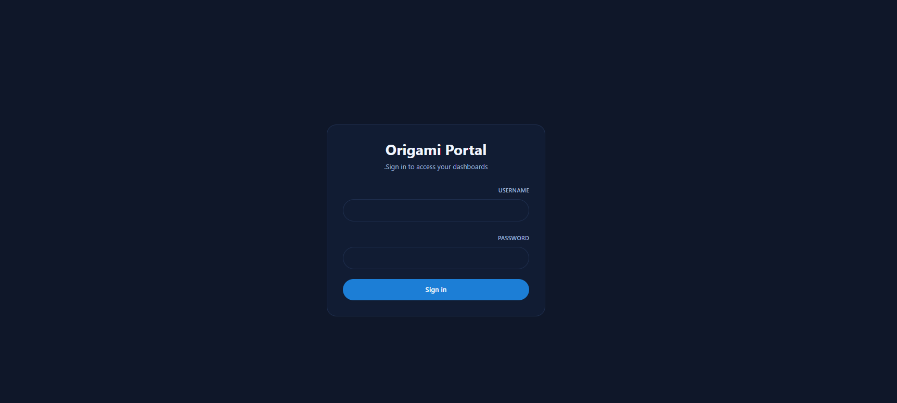
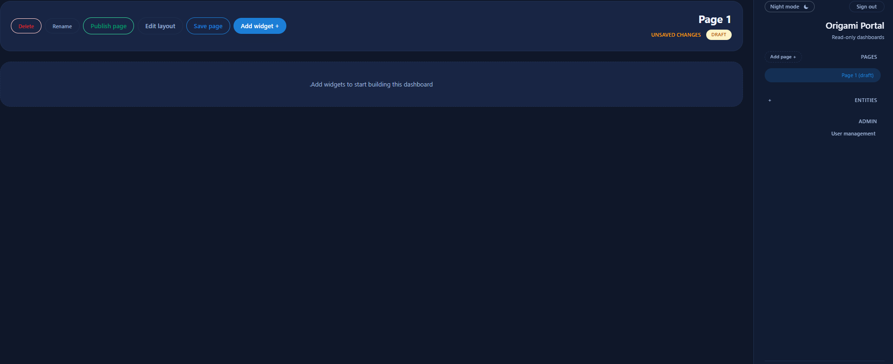

# Origami Portal

A friendly, read-only dashboard for Origami CRM data.



## Key Features

1. **Build dashboards** – Create pages and add widgets such as tables, bar charts,pie charts and so on. Use data filters and arrange the page visually.
2. **Manage access** – Create users and assign them access to specific pages.
3. **Read-only experience** – Current portal versionis read only
4. **File-backed storage** – The server does not ship with a database. Users, pages, and structure metadata live in JSON files under `server/data/`.

## What's included

- **Backend (`server/index.js`)** – Express proxy for Origami, JWT auth, user/page APIs, and static hosting.
- **Frontend (`server/client/`)** – React UI with Zustand state, widgets, and an inline page editor.
- **Data folder (`server/data/`)** – File-based storage for users, pages, and cached structure metadata.

## Prerequisites

- Node.js 18 or newer
- npm 9 or newer

## Quick start

1. `cd server`
2. `npm install`
3. Copy `.env.example` to `.env`
4. Fill in your Origami credentials and admin bootstrap values
5. Run `npm run dev`

The backend installs the React client automatically when needed and bootstraps an admin user using the credentials in `.env`.

### Environment variables

| Key | Purpose |
| --- | --- |
| `ORIGAMI_ENVIRONMENT` | Environment name used to build the Origami API base URL. |
| `ORIGAMI_USERNAME` / `ORIGAMI_API_KEY` | Service account used for all Origami requests. |
| `PORT` | Backend port (defaults to `3001`). |
| `PORTAL_ALLOWED_ORIGINS` | Comma-delimited list of allowed frontends (e.g. `http://localhost:5173,http://localhost:3001`). |
| `PORTAL_CACHE_DURATION` / `PORTAL_REFRESH_INTERVAL` | Control API caching and auto-refresh intervals. |
| `ADMIN_USERNAME` / `ADMIN_PASSWORD` | Seed admin account written to `data/users.json` on first run. |
| `JWT_SECRET` | Secret used to sign one-hour JWT sessions. |
| `VITE_API_TIMEOUT` (optional) | Override the default 60s client timeout for API requests. |

The server builds the Origami API base as https://<ORIGAMI_ENVIRONMENT>.origami.ms/entities/api, so only set ORIGAMI_ENVIRONMENT to the short environment name.


## Development workflow

`cd server` then `npm run dev` runs Nodemon and Vite side by side. The React client lives on `http://localhost:5173`, while API requests go to `http://localhost:3001/api/*`. Logs in the terminal show when `.env` loads, when Origami data refreshes, and when pages/users are saved.

## Production / QA build

From the `server/` directory:

```bash
npm run build   # builds the client with Vite
npm start       # serves the client + API on PORT
```

After building, Express serves the compiled assets from `server/client/dist`. Deploy the `server/` directory, copy `.env`, and ensure `server/data/` is writable so user, page, and structure files can persist.

## Data flow

The backend proxies Origami endpoints, caches responses for the configured duration, and exposes manual refresh routes. Widgets consume those APIs to render tables, charts, and KPIs.




## Deployment tips

- Back up `server/data/` or replace the file stores with your own persistence layer if you need redundancy.

- after you add a widget save the page and refresh  to view it